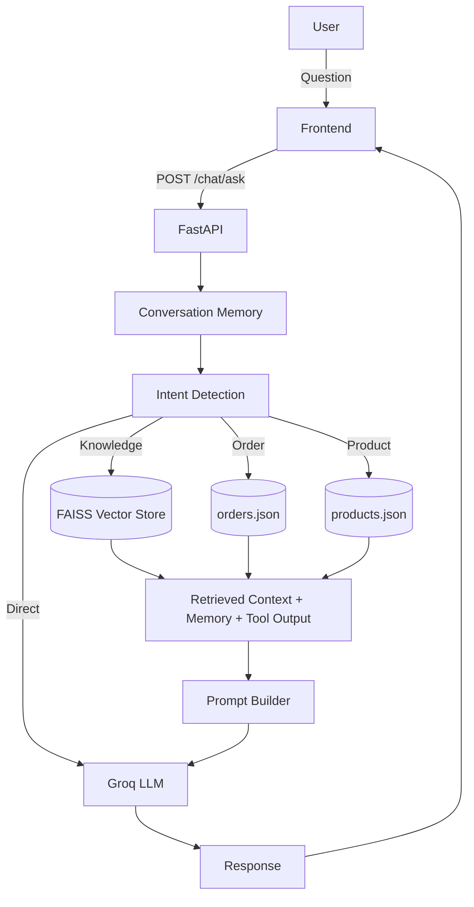

# Mini AI Assistant 🤖

A lightweight **RAG (Retrieval-Augmented Generation)** API built with FastAPI. Upload documents, ask questions, and get answers powered by your preferred LLM — all through a clean REST API.

---


---
# Live : https://huggingface.co/spaces/AnukulChandra/Mini-AI_Assistant

---

## Overview 📋

Mini AI Assistant lets you:

- Upload PDF, TXT, and Markdown documents
- Automatically chunk and index them into a FAISS vector store
- Ask questions about the uploaded documents
- Retrieve the most relevant chunks and generate answers via an LLM
- Look up orders and products from local JSON files via smart tool routing
- Keep conversation history across turns

---

## Features ✨

| Feature | Description |
|---|---|
| **Document Ingestion** | Upload `.pdf`, `.txt`, or `.md` files — automatically validated, read, chunked, and indexed |
| **Vector Search** | FAISS-powered similarity search over document chunks |
| **Multi-Provider LLM** | Switch between OpenAI, Google Gemini, Hugging Face, and Groq via an environment variable |
| **RAG Pipeline** | Retrieves the most relevant context before generating answers |
| **Tool Routing** | Detects order IDs (`ORD-1001`) and product IDs (`PRD-1001`) in questions and returns structured JSON data |
| **Conversation Memory** | Remembers the last 10 question-answer pairs and includes them in context |
| **Error Handling** | Graceful error messages with proper HTTP status codes and logging |

---

## Architecture 🏗️



**Document ingestion flow:** `POST /upload/document` → validate → read → split_text → create_vector_store → save to disk.

---

## AI Pipeline 🧠

1. **User uploads a document** — Upload a PDF, TXT, or Markdown file via the frontend.
2. **Document validation** — The file extension and content are validated against allowed types.
3. **Text extraction** — Text is extracted from PDFs using PyPDF or read directly from plain-text files.
4. **Chunking** — Extracted text is split into overlapping chunks using `RecursiveCharacterTextSplitter`.
5. **Embedding generation** — Each chunk is converted into a vector embedding using `sentence-transformers/all-MiniLM-L6-v2`.
6. **FAISS indexing** — Embeddings are indexed in a FAISS vector store and persisted to disk.
7. **User asks a question** — The question is submitted through the chat interface.
8. **Load conversation memory** — Previous question-answer pairs are loaded from in-memory history.
9. **Intent detection** — The system classifies the question as Knowledge, Order, Product, or Direct LLM.
10. **Route to:**
    - **Knowledge Retrieval** — Perform similarity search over the FAISS index for relevant chunks.
    - **Order Tool** — Look up order status from `orders.json`.
    - **Product Tool** — Search product details in `products.json`.
11. **Build prompt** — Retrieved context, tool output, and conversation history are assembled into a structured prompt.
12. **Generate answer using Groq** — The prompt is sent to the Groq LLM (`llama-3.3-70b-versatile`) for response generation.
13. **Return response** — The answer is sent back to the frontend and displayed to the user.

---

## Prompt Design 📝

The system prompt instructs the assistant to answer only using the provided information. Conversation history is included when available so follow-up questions maintain context. Tool results (order status, product details) are injected directly into the response without querying the vector store.

- **Knowledge questions** — Retrieved document chunks are placed in the prompt as context. The assistant must answer from those chunks alone.
- **Memory questions** — Previous conversation turns are prepended so the assistant can reference past exchanges.
- **Tool queries** — The tool result is formatted into a natural-language answer and returned immediately without LLM generation.

If the answer cannot be found in the uploaded documents, the assistant replies:

> *"I couldn't find that information in the uploaded documents."*

---

## Screenshots 📸

| Feature | Preview |
|----------|---------|
| **🏠 Home Interface** |  |
| **📄 Document Upload** |  |
| **💬 Knowledge Base Chat (RAG)** |  |
| **🧠 Conversation Memory** |  |
| **📦 Order Status Tool** |  |
| **🛒 Product Search Tool** |  |

---

## Project Structure 📁

```
Mini-Ai-Assistant/
├── api/
│   ├── chat.py            # POST /chat/ask endpoint
│   └── upload.py          # POST /upload/document endpoint
├── services/
│   ├── chunking.py        # Text splitting
│   ├── embeddings.py      # HuggingFace embedding model
│   ├── ingestion.py       # File validation & text extraction
│   ├── llm.py             # Multi-provider LLM dispatch
│   ├── memory.py          # In-memory conversation history
│   ├── prompt_builder.py  # RAG prompt construction
│   ├── retrieval.py       # FAISS vector search
│   ├── tools.py           # Order/product lookup tools
│   └── vector_store.py    # FAISS create/save/load
├── data/
│   ├── orders.json        # Sample order data
│   ├── products.json      # Sample product data
│   └── vector_store/      # Persisted FAISS index
├── main.py                # FastAPI entry point
├── .env.example           # Environment template
├── requirements.txt       # Python dependencies
└── README.md              # This file
```

---

## Installation 🛠️

### Prerequisites

- Python 3.10+
- pip

### Steps

```bash
# Clone the repository
git clone https://github.com/Anukul-Chandra/Mini-Ai-Assistant.git
cd Mini-Ai-Assistant

# Create and activate a virtual environment
python -m venv .venv
source .venv/bin/activate    # Linux/macOS
.venv\Scripts\activate       # Windows

# Install dependencies
pip install -r requirements.txt
```

---

## Environment Variables 🔐

Copy `.env.example` to `.env` and fill in your API keys:

```bash
cp .env.example .env
```

| Variable | Description | Default |
|---|---|---|
| `LLM_PROVIDER` | Active LLM backend | `openai`, `gemini`, `huggingface`, or `groq` |
| `OPENAI_API_KEY` | OpenAI API key | — |
| `GEMINI_API_KEY` | Google Gemini API key | — |
| `GROQ_API_KEY` | Groq API key | — |
| `HF_API_KEY` | Hugging Face Inference API key | — |
| `HF_TOKEN` | Hugging Face token (for embedding model) | — |

> Set `LLM_PROVIDER` to your chosen backend. Only the corresponding API key is required — the rest can be left blank.

---

## Running the Project 🚀

```bash
uvicorn main:app --reload
```

The API will be available at **http://localhost:8000**.

Interactive API docs: **http://localhost:8000/docs** (Swagger UI)

---

## API Endpoints 📡

### `GET /`

Health check.

**Response:**
```json
{
  "message": "Mini AI Assistant API is running"
}
```

---

### `POST /upload/document`

Upload a document for indexing.

| Parameter | Type | Description |
|---|---|---|
| `file` | `multipart/form-data` | PDF, TXT, or Markdown file |

**Response `200`:**
```json
{
  "filename": "report.pdf",
  "chunks": 12,
  "message": "Document processed and indexed successfully."
}
```

**Response `400`:** Invalid file type or unreadable document.

---

### `POST /chat/ask`

Ask a question about your documents.

**Request:**
```json
{
  "question": "What is this document about?"
}
```

**Response `200` (RAG):**
```json
{
  "question": "What is this document about?",
  "answer": "The document discusses quarterly sales performance...",
  "retrieved_chunks": 3
}
```

**Response `200` (Tool):**
```json
{
  "source": "tool",
  "answer": {
    "order_id": "ORD-1001",
    "status": "shipped",
    "total": 245.99
  }
}
```

**Response `400`:** No document uploaded or LLM configuration error.

---

## Supported LLM Providers 🧠

| Provider | Env Value | Model | SDK |
|---|---|---|---|
| **OpenAI** | `openai` | `gpt-4o-mini` | `openai` |
| **Google Gemini** | `gemini` | `gemini-2.0-flash` | `google-generativeai` |
| **Hugging Face** | `huggingface` | `microsoft/Phi-3.5-mini-instruct` | `huggingface-hub` |
| **Groq** | `groq` | `llama-3.3-70b-versatile` | `groq` |

Switch between them by changing the `LLM_PROVIDER` environment variable.

---

## Example Requests 💻

### Upload a document

```bash
curl -X POST http://localhost:8000/upload/document \
  -F "file=@document.pdf"
```

### Ask a question (RAG)

```bash
curl -X POST http://localhost:8000/chat/ask \
  -H "Content-Type: application/json" \
  -d '{"question": "What are the key findings?"}'
```

### Ask about an order (tool routing)

```bash
curl -X POST http://localhost:8000/chat/ask \
  -H "Content-Type: application/json" \
  -d '{"question": "Show me order ORD-1001"}'
```

---

## Example Responses 📤

**RAG answer:**
```json
{
  "question": "What is the revenue for Q3?",
  "answer": "Based on the uploaded document, the revenue for Q3 was $1.2 million, representing a 15% increase over Q2.",
  "retrieved_chunks": 3
}
```

**Tool lookup:**
```json
{
  "source": "tool",
  "answer": {
    "order_id": "ORD-1001",
    "customer": "John Doe",
    "status": "delivered",
    "items": ["Laptop", "Mouse"],
    "total": 1249.99
  }
}
```

**Error:**
```json
{
  "detail": "No vector store found. Please upload a document first."
}
```

---

## Technology Stack 🛠️

| Category | Technology |
|---|---|
| **Framework** | FastAPI |
| **Server** | Uvicorn |
| **Embeddings** | sentence-transformers (`all-MiniLM-L6-v2`) |
| **Vector Store** | FAISS (CPU) |
| **PDF Parsing** | PyPDF |
| **LLM SDKs** | OpenAI, Google Generative AI, Hugging Face Hub, Groq |
| **Environment** | python-dotenv |

---

## Future Improvements 🚧

- [ ] Authentication and API key management
- [ ] Persistent conversation storage (SQLite / PostgreSQL)
- [ ] Multi-document upload and per-document scoping
- [ ] Streaming responses via Server-Sent Events
- [ ] Document deletion and re-indexing
- [ ] Evaluation metrics for RAG quality (faithfulness, relevance)
- [ ] Docker image for one-command deployment

---

## License 📄

This project is licensed under the MIT License.
